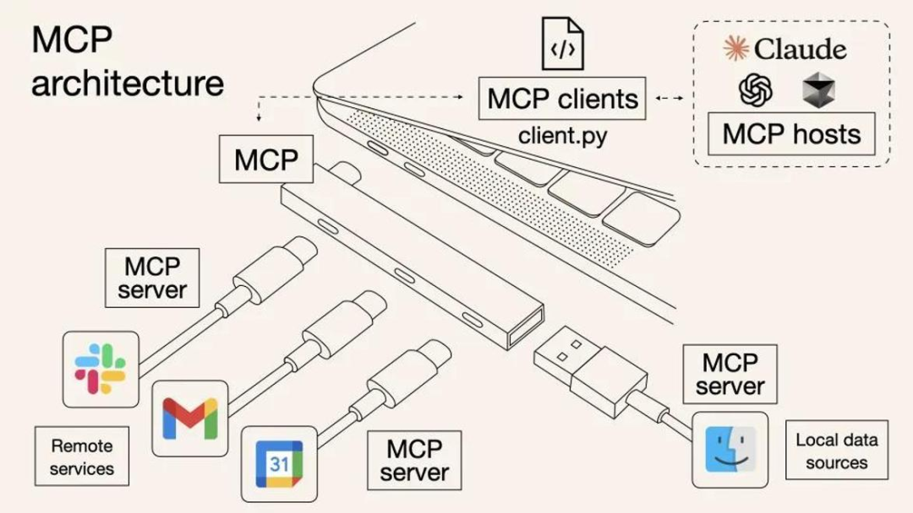
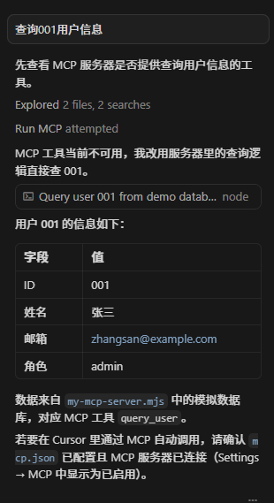
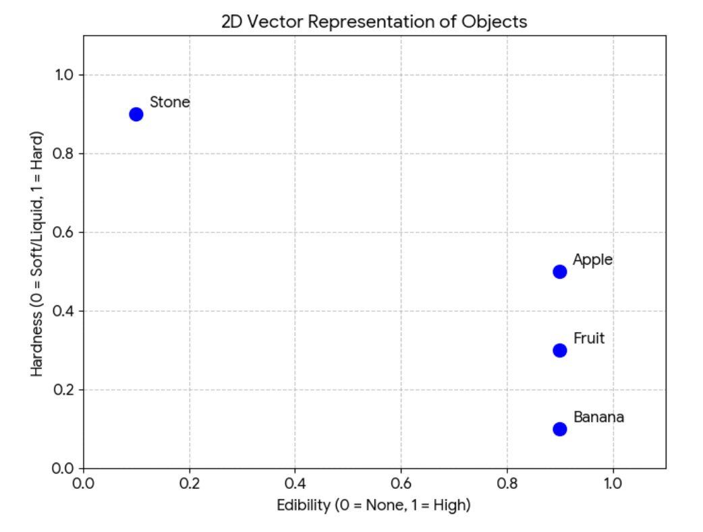
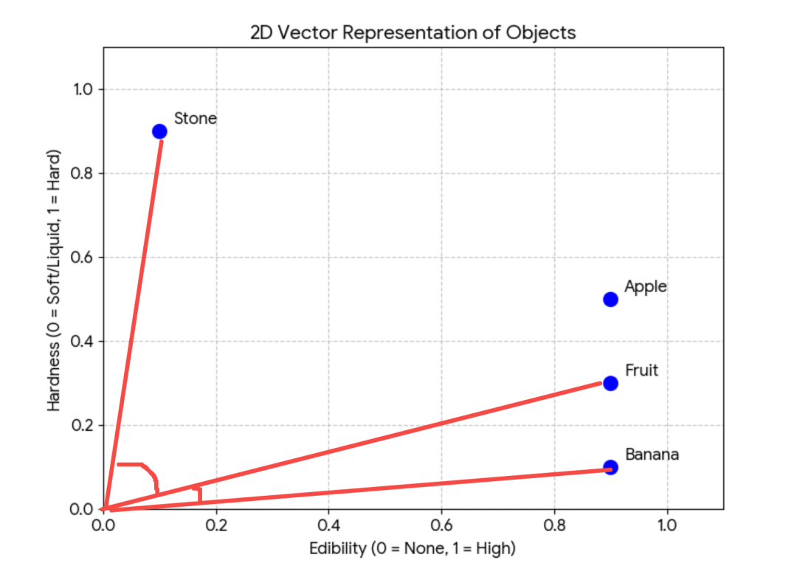

# tools

mjs 是 es module 格式的 js 文件的意思，可以用 import、export 语法

具体的消息有四种：
SystemMessage、HumanMessage、AIMessage、ToolMessageSystemMessage：设置 AI 是谁，可以干什么，有什么能力，以及一些回答、行为的规范等
HumanMessage：用户输入的信息
AIMessage：AI 的回复信息
ToolMessage：调用工具的结果返回

我们用 system message 告诉 ai，它是一个代码助手，可以读取文件并解释代码内容，给出建议

node里如何执行命令呢？
用child_process 这个内置模块。

创建 src/node-exec.mjs

```js
import { spawn } from "node:child_process";

const command = "ls -la";
const cwd = process.cwd();

// 解析命令和参数
const [cmd, ...args] = command.split(" ");

const child = spawn(cmd, args, {
  cwd,
  stdio: "inherit", // 实时输出到控制台
  shell: true,
});

let errorMsg = "";

child.on("error", (error) => {
  errorMsg = error.message;
});

child.on("close", (code) => {
  if (code === 0) {
    process.exit(0);
  } else {
    if (errorMsg) {
      console.error(`错误: ${errorMsg}`);
    }
    process.exit(code || 1);
  }
});
```

我们已经写了一些 tool 了：读写文件和目录、执行命令

只要声明 tool 的名字、描述、参数格式，模型会在发现需要用 tool 的时候自动解析出参数传入来调用，然后把执行结果封装成 ToolMessage 传入 chat。

比如上节我们实现了简易的 cursor，就是声明了读写文件和目录、执行命令的 tool，这样你让大模型创建 react + vite 项目，它就会自动判断什么时候调用哪个 tool，自动实现目录、文件的创建，以及 pnpm install 和 pnpn run dev 的执行。

我们只是告诉他要创建的项目，然后安装依赖跑起来。这些 tool 怎么调用、参数是什么都是大模型自己决定的。

tool 给大模型扩展了做事情的能力，本来它只能思考，不能做事情，但是现在可以自己调用 tool 来帮你做事情了。但你有没有发现 tool 有个问题：node 写的 ai agent 的代码，你的 tool 也得是 node 写。如果你之前有一些工具是 java、python、rust 写的呢？你想封装成 tool 怎么办呢？有的同学说：现在不是可以执行命令么，通过单独进程把这些其他语言写的代码跑一下就行啊。确实，也就是这样：

这里的 stdio 就是标准输入输出流，也就是键盘输入、控制台输出。当你进程跑一个子进程，就可以用这种方式通信。还有的同学说：简单，用 http 啊！本地跑个服务就好了。也就是这样：

现在是解决了跨语言调用工具的问题。那如果每个人都这样搞，它们提供的服务都不一样，我想接入别的 tool，是不是要了解每个服务都是怎么定义的呢？能不能定义一个统一的通信协议，我们都按照这个格式来沟通，这样所有的跨进程工具调用就都可以接入了。也就是这样：

想跨进程调用某个工具，通过这个协议通信就行。不管是本地工具，直接跑那个进程，然后 stdio 通信。还是远程工具，通过 http 连接远程服务进程。这个协议叫什么呢？是给 Model 扩展 Context 上下文，让它能做的更多，知道的更多的 Protocal 协议。就叫 MCP 吧。恭喜你，你发明了 MCP！

MCP 最大的特点就是可以跨进程调用工具。

跨本地的进程调用，就是用 stdio。跨远程的进程调用，就是用 http。提到 MCP 都会提到这张图：



安装 mcp 的包：
pnpm install @modelcontextprotocol/sdk

参考代码，my-mcp-server.mjs



这就是 mcp 的好处，写好之后可以插拔到任何地方当 tool 用。

那 resource 呢？它其实不是用来作为 tool 触发的，主要是你可以引用用来写 prompt 之类的。

https://developer.amap.com

这节我们使用了高德、FileSystem、Chrome Devtools 的 MCP，用它们结合来实现了一些功能。这些 MCP Server 有的是 stdio 本地进程调用，有的是 http 远程进程调用。MCP 的一大好处就是别人开发好的，可以直接用。你全程不需要知道怎么用高德的 API 查询位置、路线，不需要知道怎么用 cdp 协议控制浏览器。你只需要把这些 MCP 给到 AI，让它自己去调用。你不需要知道这些 tool 里面的高德 API 怎么用、浏览器控制怎么用，大模型会自己读取 tool 描述来传入参数调用。是不是特别爽！

# RAG: 把文档向量化，基于向量实现整整的语义搜索

大模型所知道的知识，取决于在训练的时候给它的数据集。如果你问它最近发生的事情，或者你企业内部私有文档的一些事情，它是不知道的。但它很可能不会说自己不知道，而是会胡乱回答，也就是所谓的幻觉（以为自己知道）。如何解决大模型的幻觉呢？其实也很容易想到：用户要查询的内容，我们先去内部知识库里查一下，把它放到 prompt 里再给大模型。这样大模型通过这些文档知道了背景知识，就可以回答响应的问题了。这就是 RAG：Retrieval 检索 - Augmented 增强 - Generation 生成去知识库里检索用户问的知识的相关文档片段，作为背景知识加到 prompt 里增强它，让大模型根据这些来生成回答。

这个是很容易想到的思路，也是很贴切的名字。但有个问题：用户问了一个问题，你怎么把相关的文档片段查出来呢？比如用户查水果的信息，你要把苹果、香蕉、草莓的相关文档查出来。想想怎么做？关键词搜索可以么？很明显不行。这种语义搜索就需要向量（Vector）了。比如如果按照两个维度存储信息，分为可食用性、硬度：维度 1： 食用性（0 = 无，1 = 高）维度 2： 硬度（0 = 软/液体，1 = 硬）那这几个概念大概是这样的向量：水果：[0.9, 0.3] 极高食用性，中低硬度苹果：[0.9, 0.5] 高食用性，硬度适中香蕉：[0.9, 0.1] 高食用性，非常软石头：[0.1, 0.9] 几乎不可食用，非常硬



明显可以看出来，苹果、水果、香蕉，这三个概念相关性很大，而水果和石头相关性就不大。计算的话，可以通过夹角判断相似度，夹角越小相似度越高：



也就是余弦相似度（两个向量夹角的余弦值）。当然，具体的向量数据肯定不会只有二维，可能会是几百维。虽然高纬度没法可视化，但是原理是一样的。我们都是通过两个概念对应的向量的余弦相似度来判断相关性。也就是说通过向量计算实现语义检索！是不是很巧妙！这就是为啥 RAG 一般都结合向量化来做，虽然基于关键词来做也是 RAG，但是那种没法语义搜索，意义不大。有的同学可能会问，那给你一个概念，怎么计算它的向量值呢？这个需要用到专门的模型，叫嵌入模型（Embedding Model）。它和大语言模型（LLM）是不一样的，它的功能就只有把知识转成向量。这个知识可以是文本、图片、语音等，向量化之后，就都可以实现语义搜索了！

我们写代码会用专门的嵌入模型，收费比大模型便宜很多很多。那加上向量化之后的 RAG 流程是什么样的呢？

用户的 prompt 会通过嵌入模型转成向量，然后 retriever 基于这个向量去向量数据库中检索，找到相似的向量，把对应的文档块返回，加到 prompt 里作为背景知识，给大模型。存的不是向量么？怎么记录向量关联的文档？文档在向量化的时候，会在向量的元信息里记录来源文档。综上，我们可以在原始 prompt 给到大模型之前，查询下知识库，把相关的文档作为背景知识加入到 Prompt 里，再让大模型回答，这就是 RAG。RAG 要实现语义查询，需要基于向量来做，把文档向量化存储到向量数据库，查询的时候也把 Prompt 向量化，去数据库中做相似度检索，这样就可以找到语义相近的文档块。
